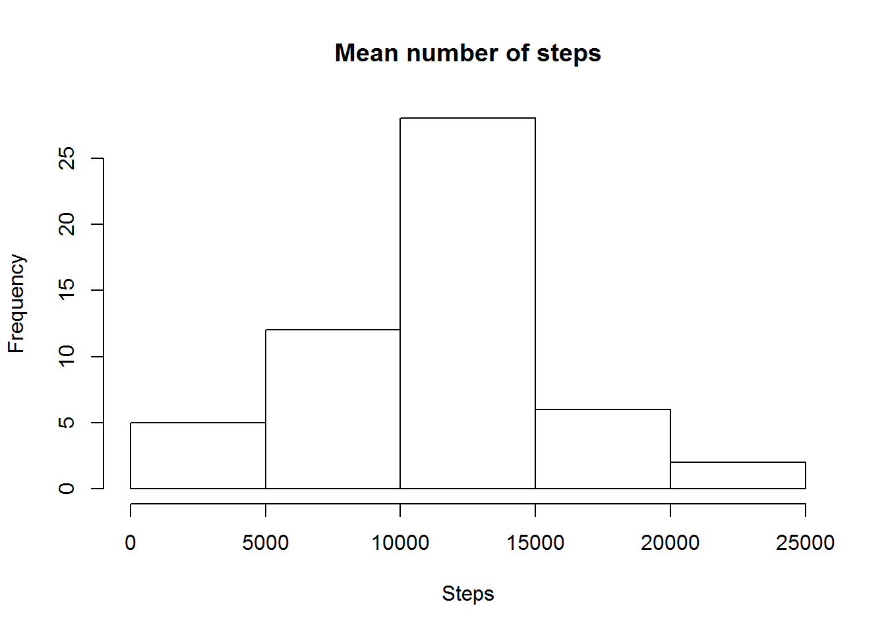

Reading in the data

    echo=TRUE
    temp <- tempfile()
    download.file("https://d396qusza40orc.cloudfront.net/repdata%2Fdata%2Factivity.zip",temp)
    d <- read.csv(unz(temp, "activity.csv"), sep=",", header=TRUE)
    d$date<-as.Date(d$date)
    unlink(temp)

Mean steps per day
==================

Histogram
---------

    echo=TRUE
    d1<-aggregate(steps~date,data=d,sum)
    hist(d1$steps, main="Mean number of steps", xlab="Steps")

Mean
----

    echo=TRUE
    mean(d1$steps)

    ## [1] 10766.19

Median
------

    echo=TRUE
    median(d1$steps)

    ## [1] 10765

Average daily activity pattern
==============================

    d2<-aggregate(steps~interval, d, mean)
    plot(d2$interval, d2$steps, type='l', col=1, main="Average number of steps by Interval", xlab="Time Intervals", ylab="Average number of steps")

Maximum
-------

    int <- which.max(d2$steps)
    d2[int,]

    ##     interval    steps
    ## 104      835 206.1698

Missing data
============

Number of missing values
------------------------

    mis <- length(which(is.na(d$steps)))

Imputing means
--------------

    #obtain mean, merge back to file and replace missing values
    a<-aggregate(steps~interval,data=d,mean)
    a$mean<-a$steps
    a$steps<-NULL
    i<-merge(d,a, by="interval",all=TRUE)
    i$steps[is.na(i$steps)]<-i$mean[is.na(i$steps)]

Historam with imputed values
----------------------------

    i1<-aggregate(steps~date,data=i,sum)
    hist(i1$steps, main="Mean number of steps", xlab="Steps")

    mean(i1$steps)

    ## [1] 10766.19

    median(i1$steps)

    ## [1] 10766.19

Creating a weekday weekend variable
-----------------------------------

    i$weekday <-  ifelse(as.POSIXlt(i$date)$wday %in% c(0,6), 'weekend', 'weekday')

Time series plot
----------------

    require(ggplot2)

    ## Loading required package: ggplot2

    i2 <- aggregate(steps ~ interval + weekday, data=i, mean)
    ggplot(i2, aes(interval, steps)) + 
        geom_line() + 
        facet_grid(weekday ~ .) +
        xlab("5-minute interval") + 
        ylab("avarage number of steps")

